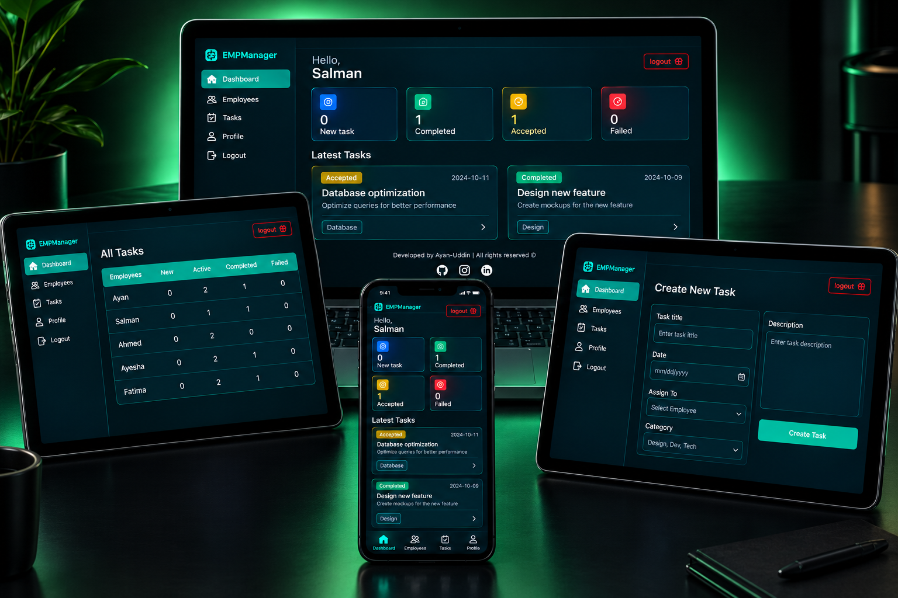

# 👨‍💼 Employee Management System

A responsive Employee Management System built with React.js that allows an admin to create and assign tasks to employees, while employees can log in and manage their assigned tasks through their own dashboard.
The project uses localStorage for data persistence, so it works without a separate backend or database.

## ✨ Features

### 🔐 Authentication

- Admin login
- Employee login
- Separate Admin and Employee dashboards
- Demo credentials available for testing

### 👨‍💼 Admin Dashboard

- Create new tasks
- Assign tasks to employees
- Select employees from a dropdown
- Set task title
- Add task description
- Set task date
- Add task category
- View all employees
- View employee task statistics

### 👨‍💻 Employee Dashboard

Employees can view:

- 🆕 New tasks
- 🟡 Accepted tasks
- ✅ Completed tasks
- ❌ Failed tasks
- 📋 Latest assigned tasks

Each task includes:

- Task title
- Description
- Date
- Category
- Current status

### 📊 Task Management

Tasks are organized into:

- 🆕 New
- 🟡 Accepted
- ✅ Completed
- ❌ Failed

The dashboard also displays task counts for each status.

### 💾 Local Storage

The application uses browser localStorage to store:

- Employee data
- Admin data
- Tasks
- Task counts
- Authentication data

This allows the project to work without an external backend.

### 📱 Responsive Design

The interface is designed for:

- 💻 Desktop
- 💻 Laptop
- 📱 Mobile
- 📟 Tablet

## 🛠️ Technologies Used

- ⚛️ React.js
- 🟨 JavaScript
- 🎨 CSS3
- 🌐 HTML5
- 🔄 React Context API
- 🪝 React Hooks
- 💾 localStorage
- ⚡ Vite

## 🔄 How It Works

### Admin

The admin logs in and creates tasks from the Admin Dashboard.

Admin flow:

Admin Login → Admin Dashboard → Create Task → Select Employee → Assign Task

### Employee

The employee logs in and views the tasks assigned to their account.

Employee flow:

Employee Login → Employee Dashboard → View Assigned Tasks → Track Task Status

## 🔑 Demo Credentials

### 👨‍💼 Admin

Email: admin@me.com  
Password: 123

### 👨‍💻 Employees

Employee 1  
Email: employee1@example.com  
Password: 123

Employee 2  
Email: employee2@example.com  
Password: 123

Employee 3  
Email: employee3@example.com  
Password: 123

Employee 4  
Email: employee4@example.com  
Password: 123

Employee 5  
Email: employee5@example.com  
Password: 123

## 🔮 Future Improvements

- 🔗 Connect a real backend
- 🗄️ Add a database
- 🔐 Add JWT authentication
- ✏️ Edit tasks
- 🗑️ Delete tasks
- 🔎 Search and filter tasks
- 👤 Employee profile management
- 🔔 Notifications
- 🛡️ Role-based authorization
- ☁️ Deploy the application

## 👨‍💻 Author

**Ayan Uddin**

Frontend / MERN Stack Developer

⭐ If you like the project, feel free to explore the repository and try the demo credentials.